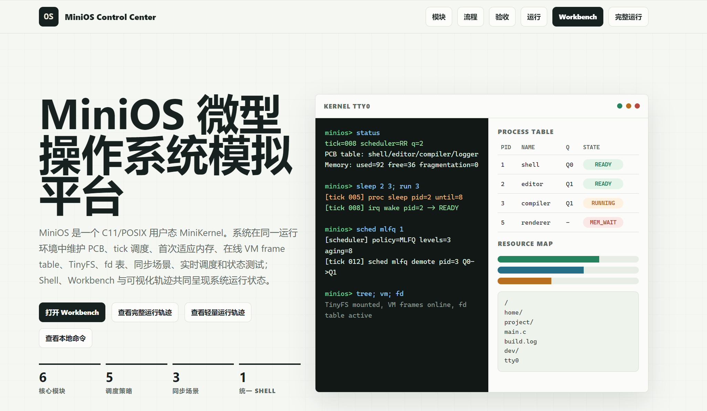
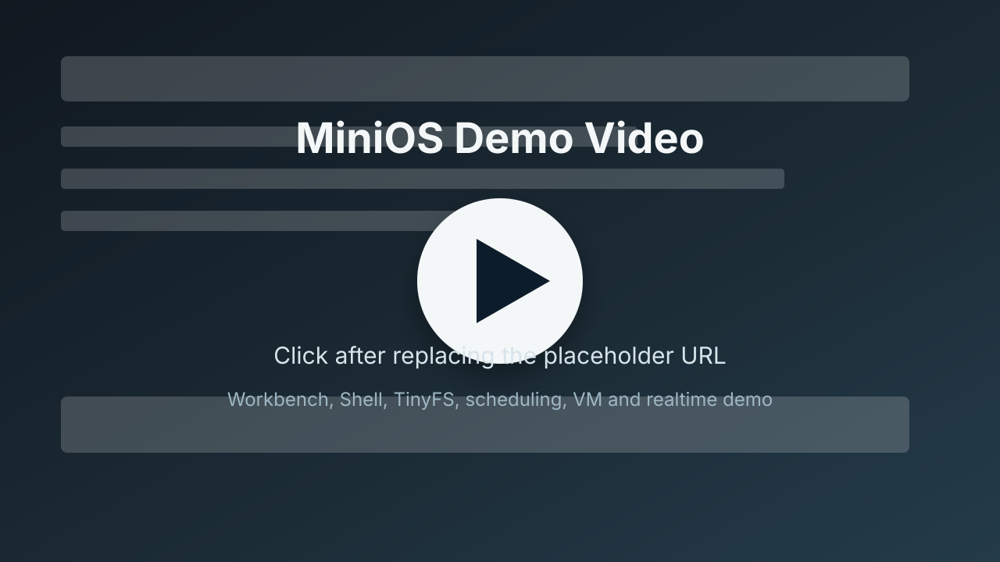

# MiniOS

MiniOS 是一个基于 **C11 + Linux/POSIX** 的用户态操作系统模拟平台。项目将进程管理、处理机调度、内存管理、页面置换、TinyFS 文件系统、进程同步、实时调度和状态分析统一到同一个 MiniOS Shell 中，并提供浏览器 GUI 和 Workbench 作为可视化演示入口。

它不是可启动的裸机内核，而是一个用于学习、实验和展示操作系统核心机制的完整模拟环境。用户可以在终端或浏览器 Workbench 中创建进程、推进 tick、观察 PCB 和 dmesg、操作 TinyFS、读写 fd、切换调度策略，并生成可复现的测试记录。

## Preview



<!--
Replace the preview image above after capturing the real homepage or Workbench screenshot.

Suggested options:
- Keep the image in this repository, for example: demo/assets/readme-homepage.png
- Or use a GitHub uploaded image URL, for example: https://github.com/user-attachments/assets/...

Recommended screenshot targets:
- http://127.0.0.1:8000/
- http://127.0.0.1:8001/workbench.html
-->

## Demo Videos

Example Demo:

[](https://github.com/user-attachments/assets/REPLACE_WITH_EXAMPLE_DEMO_VIDEO)

Workbench Demo:

[](https://github.com/user-attachments/assets/REPLACE_WITH_WORKBENCH_DEMO_VIDEO)

<!--
Replace the placeholder links above with the real demo video URLs after uploading your videos.

Recommended GitHub workflow:
1. Record an .mp4, .mov, or .webm demo video.
2. Upload it to a GitHub issue, pull request comment, or README edit box.
3. Copy the generated https://github.com/user-attachments/assets/... URL.
4. Replace REPLACE_WITH_EXAMPLE_DEMO_VIDEO and REPLACE_WITH_WORKBENCH_DEMO_VIDEO in the links above.

If you want GitHub to render the videos as inline media attachments, paste the generated URLs on their own lines below and remove this comment.

https://github.com/user-attachments/assets/REPLACE_WITH_EXAMPLE_DEMO_VIDEO
https://github.com/user-attachments/assets/REPLACE_WITH_WORKBENCH_DEMO_VIDEO
-->

## Features

| Module | What It Shows |
| --- | --- |
| MiniKernel | PCB table, tick scheduling, process states, BLOCKED/wakeup, MEM_WAIT, context switches, dmesg |
| Scheduling | FCFS, SJF, Priority, Round Robin, HRRN comparison, MLFQ with aging |
| Memory | First-fit dynamic partitioning, allocation/free, block merging, fragmentation statistics |
| Virtual Memory | Online frame table, FIFO/LRU replacement, page access history and fault rate comparison |
| Synchronization | Producer-consumer, readers-writers, dining philosophers with pthread mutex/semaphore |
| TinyFS | Directories, files, path operations, free block bitmap, save/load/fscheck image validation |
| File Descriptors | `open/readfd/writefd/seekfd/close`, offsets, modes, EOF, deleted path with opened fd |
| Realtime Scheduling | EDF/RMS periodic task simulation, job timeline, deadline miss and utilization |
| State Analysis | `tracebench`, `benchmark-subset`, `autotune`, CSV export and Markdown performance report |
| Web UI | MiniOS Control Center, Full Demo story page, browser Workbench connected to a real MiniOS Shell |

## Requirements

- Linux or WSL
- `gcc` with C11 support
- `make`
- `python3`
- POSIX threads support

Optional:

- `valgrind` for memory checking
- A modern browser for GUI Demo and Workbench

## Quick Start

Build and run the default tour:

```bash
make
make run
```

Enter the interactive MiniOS Shell:

```bash
./build/os_project
```

Run the full verification suite:

```bash
make verify
```

Expected core test output:

```text
core tests passed
```

## Main Entry Points

```bash
make run                 # Run the default MiniOS tour
make story               # Run the Lite demo
make story-full          # Run the Full Demo
make story-full-check    # Validate the Full Demo transcript
make story-gui           # Start the browser GUI service
make workbench           # Start the browser Workbench
make workbench-story     # Run the Workbench long scenario
make workbench-check     # Run a broad Workbench command sweep
make tracebench          # Run multi-configuration state analysis
make performance-report  # Export CSV and Markdown analysis reports
make valgrind            # Run valgrind if installed
```

Example Demo:

```text
make story-gui
http://127.0.0.1:8000/
http://127.0.0.1:8000/minios_story.html
http://127.0.0.1:8000/minios_story.html?mode=full
```

Workbench Demo:

```text
make workbench
http://127.0.0.1:8001/workbench.html
```

## MiniOS Shell

The Shell is the unified control surface for MiniOS. It supports manual commands, scripted tours, and browser Workbench forwarding.

```text
help | about | overview              Show help and project overview
status | ps | top                    Show kernel status, PCB, memory and files
dmesg                                Show kernel event log
pwd | cd | ls | tree | clear | echo  Basic Unix-like shell commands
create <name> <burst> <mem> [prio]   Create a process
tick [n] | run [n]                   Advance scheduler ticks
sleep <pid> <ticks>                  Block a process and wake it by timer
kill <pid>                           Terminate a process and reclaim memory
sched                                Show current scheduler
sched rr <q>|mlfq <q>|fcfs|sjf|priority
sched compare [q]                    Compare scheduling algorithms on current PCB snapshot
mem                                  Show first-fit memory partitions
access <pid> <page>                  Record an online VM page access
vm [fifo|lru|reset|frames n]         Configure online VM
page [frames]                        Replay FIFO/LRU page replacement on access history
mkdir | rmdir | touch | put | write  TinyFS directory and file operations
cat | rm | savefs | loadfs | fscheck TinyFS read/delete/image operations
open <path> [r|w|a|rw]               Open a TinyFS file
readfd | writefd | seekfd | close    File descriptor operations
fd | fds                             Show open-file table
sync [all|pc|rw|dp]                  Run synchronization experiments
realtime [time]                      Run EDF/RMS realtime scheduling
tracebench | bench                   Run MiniOS state analysis workloads
benchsubset [scale] [iters]          Run teaching subset metrics
autotune [scale] [iters]             Recommend scheduler/VM/sync settings
benchcsv <path> [scale] [iters]      Export metrics to CSV
perfreport <path> [scale] [iters]    Export a Markdown performance report
exit | shutdown                      Exit MiniOS
```

Example:

```bash
./build/os_project tour --mode lite
./build/os_project tour --mode full
printf 'status\nrun 3\ndmesg\nexit\n' | ./build/os_project tour --script -
```

## Browser Workbench

Workbench turns MiniOS Shell into a browser-based operating environment. It includes:

- TinyFS resource explorer
- File tabs and editor
- Integrated terminal
- Command palette
- Kernel status sidebar
- Module shortcuts
- Tab completion and relative path support
- Ctrl-S save
- Right-click file actions
- `$fd` alias for the most recent fd returned by `open`

The terminal is not a static mock. Commands are forwarded by `scripts/workbench_server.py` to a real `build/os_project tour --interactive` process, so TinyFS, PCB, VM, fd table and dmesg state change as commands are executed.

For a manual recording workflow, see:

```text
docs/workbench_manual_recording_guide.md
```

## Verification

`make verify` performs a clean end-to-end verification:

```bash
make clean
make test
make shell-check
make story-full-check
make workbench-story-check
make workbench-check
make workbench-fd-check
make evidence
```

Generated records are written under `build/`, which is ignored by git:

```text
build/evidence/core_tests.txt
build/evidence/full_demo.log
build/evidence/tour_default.log
build/evidence/tracebench.log
build/evidence/benchmark_subset.log
build/evidence/autotune.log
build/evidence/bench.csv
build/evidence/performance.md
build/evidence/tinyfs_fd_smoke.log
```

`make evidence` also refreshes GUI data in `demo/assets/` and synchronizes the full demo transcript to `log.txt`.

## Project Layout

```text
.
├── include/os_project.h           # Shared data structures and module APIs
├── src/
│   ├── main.c                     # CLI, Shell and tour entry point
│   ├── kernel.c                   # MiniKernel, PCB, tick scheduling, dmesg
│   ├── scheduling.c               # FCFS/SJF/Priority/RR/HRRN scheduling
│   ├── memory.c                   # First-fit memory and FIFO/LRU paging
│   ├── sync_demo.c                # Synchronization experiments
│   ├── tinyfs.c                   # TinyFS implementation
│   ├── realtime.c                 # EDF/RMS realtime scheduling
│   ├── benchmark.c                # tracebench, autotune and reports
│   └── utils.c                    # Shared helpers
├── tests/test_core.c              # Core automated tests
├── data/                          # Tour scripts and test input data
├── demo/                          # Browser GUI and Workbench
├── scripts/                       # GUI asset export and Workbench server
├── docs/                          # Report, development notes and recording guide
├── Makefile
├── SUBMISSION.md
└── README.md
```

## Documentation

- `docs/report.md`: course report source
- `docs/report_word.html`: Word-friendly report export
- `docs/development.md`: design notes, validation records and GUI assets
- `docs/workbench_manual_recording_guide.md`: manual Workbench recording guide
- `docs/workbench_terminal_scenario.md`: long scenario design notes
- `SUBMISSION.md`: submission and verification checklist

## Design Notes

- MiniOS is a user-space simulator, not a bootable kernel.
- Numeric Shell arguments are parsed with `strtol`; invalid explicit input reports usage instead of silently falling back to zero.
- TinyFS images use a `TFSIMG2` header, payload size and checksum. Loading rejects bad magic, truncation, trailing data, checksum mismatch, invalid metadata, duplicate paths, file-directory name conflicts, block range errors and bitmap inconsistencies.
- fd allocation starts at 3. The fd table tracks owner, path, mode, offset and opened content, including EOF behavior and continued access after a path is deleted.
- MLFQ is integrated into `kernel_schedule_tick()`, so queue level changes, aging promotion, waiting time, context switches, MEM_WAIT and dmesg all evolve in the same MiniKernel state.
- `tracebench`, `benchmark-subset` and `autotune` use fixed MiniOS teaching workloads. They are intended for relative analysis inside this project, not as standard OS performance benchmarks.

## License

No license file is currently included. Add one before publishing if you want to define reuse permissions clearly.
